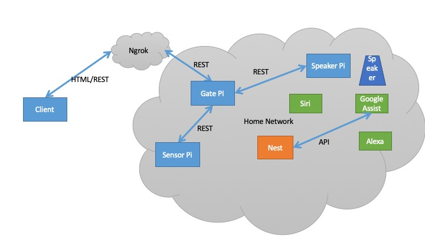

# raspberry pie projects
These are my project for the raspberry pie. Please check inside each directory to find out more about the individual project.

# Home automation and monitoring: Gateway Pie, Sensor Pie, Speaker Pie

My home automation project consists of 3 raspberry-pi projects working together:
- [gateway-pi](gate/readme.md)
- [sensor-pi](sensor/readme.md)
- [speaker-pi](speaker/readme.md)

The gate is a webserver which has a dedicated tunnel service to [NGROK](https://ngrok.com). Ngrok provides and manages the secure tunnel to the gate raspberry pi. Ngrok provides a URL that takes you to the webpage on my gate raspberry pi, when you access it you will be asked for an ID and PASSWORD.

The raspberry pies interact with each other via REST API implemented using Python FLASK. The sensor and speaker can work independently, the gate makes calls to the sensor and the speaker.

Following are some of the ways they interact with eachother and with some other components in my IOT at home.

## Gate-pi 
- checks connection with sensor-pi to determine if there is an outage
- presents a menu for the user to interact with the speaker-pi
- presents a menu for the user to view the status of the home and interact with the sensor-pi

## Speaker-pi 
- talk to Siri and Google assist
- play relaxing sounds for my dogs
- announces the date and time every hour from 4pm to 9pm
- plays the weather and traffic news station (internet stream)

## Future interactions
These are currently in the works:
- gate-pi to tweet the current conditions of the house
- gate-pi to tweet a picture of the view of the lake from my house
- speaker-pi to modify the nest spart thermostat parameters
