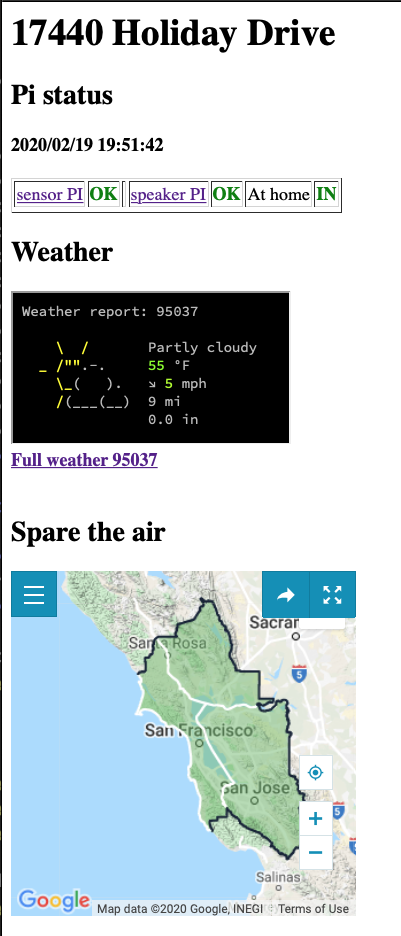
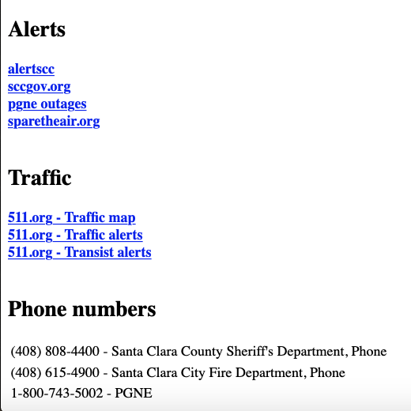

# gate-pi

# Links and Notes
- https://developers.nest.com/documentation/cloud/sample-code-auth
- https://pypi.python.org/pypi/python-nest
- https://stackoverflow.com/questions/19091087/open-redis-port-for-remote-connections
- php5-curl
  - https://www.digitalocean.com/community/questions/curl-is-not-installed-in-your-php-installation

- To check the health of the sensor.local
 - https://www.w3schools.com/python/ref_requests_get.asp

- To get weather reports
  - http://www.webupd8.org/2016/04/get-weather-information-from-terminal.html 
  - Kudos to https://github.com/chubin/wttr.in

#  To password protect

- https://stackoverflow.com/questions/4115719/easy-way-to-password-protect-php-page

