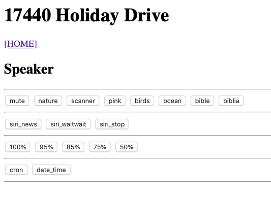

# Speaker pi
## Home page


Web pages with stations:
- https://radio-locator.com
- https://www.internet-radio.com
# Internet radio
- scanner:
  - http://198.178.123.20:10488/listen.pls
  - http://104.167.4.67:8296/listen.pls
  - http://162.244.80.118:9196/listen.pls
- nature:
  - http://192.240.102.198:14244/listen.pls
  - http://5.39.71.159:8157/listen.pls
  - http://94.23.252.14:8067/listen.pls
- bible
  - http://66.55.145.43:8018/listen.pls
  - http://64.71.79.181:6552/listen.pls
- bibla
  - http://94.23.6.53:8358/listen.pls
- birds
  - http://209.126.119.76:8200/listen.pls
- ocean
  - http://5.39.71.159:8157/listen.pls
- chill
  - http://192.99.17.12:4516/listen.pls
  - http://192.99.17.12:4950/listen.pls
- trance
  - http://uk4.internet-radio.com:8049/listen.pls
  - http://hirschmilch.de:7000/listen.pls
- bass
  - http://uk1.internet-radio.com:8118/listen.pls
- español
  - http://176.31.117.120:8115/listen.pls
- experimental
  - http://dallas.myautodj.com:8099/listen.pls
  - http://akademieradio.de:80/play.m3u
  - http://198.27.66.225:8570/listen.pls
  - http://198.15.77.50:9368/listen.pls
  - http://50.7.68.251:6982/listen.pls
- White noise
  - http://198.178.123.17:8764/listen.pls
- Local radio stations
  - https://streams.kqed.org/kqedradio
  - http://19273.live.streamtheworld.com/KCBSAMAAC_SC
- For dogs
  - https://soundcloud.com/calmpetsmusicacademy/sets/healing-frequencies-for-pets - not good for streaming
  - http://99.198.118.250:8241/listen.pls
  - http://yp.shoutcast.com/sbin/tunein-station.pls?id=1794904 - Ducks, etc.
  - http://yp.shoutcast.com/sbin/tunein-station.pls?id=1632399 - sleep scap
- Old time radio
  - http://176.31.98.109:4962/listen.pls
  - http://69.46.24.226:7006/listen.pls
  - http://74.50.122.103:7372/listen.pls
  - http://95.211.3.65:9185/listen.pls - Science Fiction

# new batch of streaming stations
- Emmanuel Y Linda - Tu Gracia 
https://www.internet-radio.com/servers/tools/playlistgenerator/?u=http://usa6.fastcast4u.com:5112/autodj&t=.pls

- Radio Amistad Kissimmee 
https://www.internet-radio.com/servers/tools/playlistgenerator/?u=http://94.23.6.53:8620/listen.pls?sid=1&t=.pls

- Sleepscapes | Rain 
https://www.internet-radio.com/servers/tools/playlistgenerator/?u=http://198.27.120.235:8850/listen.pls?sid=1&t=.pls

- Matt Johnson Meditation
https://www.internet-radio.com/servers/tools/playlistgenerator/?u=http://us2.internet-radio.com:8046/listen.pls&t=.pls

- Instrumentals Forever 
https://www.internet-radio.com/servers/tools/playlistgenerator/?u=http://184.75.223.178:8151/listen.pls?sid=1&t=.pls

- Shine Digital Christian Radio 
https://www.internet-radio.com/servers/tools/playlistgenerator/?u=http://uk5.internet-radio.com:8204/listen.pls&t=.pls

- ChroniX | AGGRESSION® 
https://www.internet-radio.com/servers/tools/playlistgenerator/?u=http://192.95.18.39:5784/listen.pls?sid=1&t=.pls

- Playing Piano At Home Alone 
https://www.internet-radio.com/servers/tools/playlistgenerator/?u=http://158.69.224.10:8004/listen.pls?sid=1&t=.pls

- CALMRADIO.COM - Classical Guitar 
https://www.internet-radio.com/servers/tools/playlistgenerator/?u=http://23.82.11.89:2728/listen.pls?sid=1&t=.pls

- GENERATION SOUL DISCO FUNK RADIO [HD] 
https://www.internet-radio.com/servers/tools/playlistgenerator/?u=http://91.121.104.123:8000/listen.pls?sid=1&t=.pls

- Studio Dance - Italian
https://www.internet-radio.com/servers/tools/playlistgenerator/?u=https://stream.laut.fm/studiodance.m3u&t=.pls

- POP EN ESPAÑOL 
https://www.internet-radio.com/servers/tools/playlistgenerator/?u=http://167.114.116.223:9823/listen.pls?sid=1&t=.pls

- Ambiesphere 
https://www.internet-radio.com/servers/tools/playlistgenerator/?u=http://uk5.internet-radio.com:8347/listen.pls&t=.pls

- Real World Sounds 
https://www.internet-radio.com/servers/tools/playlistgenerator/?u=http://uk5.internet-radio.com:8260/listen.pls&t=.pls


# Pages that have internet streaming
  - https://www.radioforge.com/faqs/find-valid-radio-stream-url-from-icecast-or-shoutcast-pls-m3u-xspf/

# Volume control
- amixer set PCM -- 100%
  - https://blog.paddlefish.net/?p=895

# Text to speach
- what worked for me was:gTTS
  - https://pythonprogramminglanguage.com/text-to-speech/

# Text only
- Lynx - text only browser
  - https://en.wikipedia.org/wiki/Lynx_(web_browser)/
  - https://opensource.com/article/16/12/web-browsers-linux-command-line
- Text only news:
  - https://greycoder.com/a-list-of-text-only-new-sites/

# Mount USB
- https://www.raspberrypi-spy.co.uk/2014/05/how-to-mount-a-usb-flash-disk-on-the-raspberry-pi/

# Flask config file
- https://pythonise.com/series/learning-flask/flask-configuration-files
- https://flask.palletsprojects.com/en/1.0.x/config/

# config file (config.py)
```
    STATIONS = {
              "nature1" : "http://192.240.102.198:14244/listen.pls",
              "nature2" : "http://5.39.71.159:8157/listen.pls",
              "nature3" : "http://162.244.80.118:9196/listen.pls",
              "chill1" : "http://192.99.17.12:4516/listen.pls",
              "chill2" : "http://192.99.17.12:4950/listen.pls",
              "trance1" : "http://uk4.internet-radio.com:8049/listen.pls",
              "trance2" : "http://hirschmilch.de:7000/listen.pls",
              "bass1" : "http://uk1.internet-radio.com:8118/listen.pls",
              "experimental1" : "http://dallas.myautodj.com:8099/listen.pls",
              "experimental2" : "http://akademieradio.de:80/play.m3u",
              "experimental3" : "http://198.27.66.225:8570/listen.pls",
              "experimental4" : "http://198.15.77.50:9368/listen.pls",
              "experimental5" : "http://50.7.68.251:6982/listen.pls",
              "dogs1" : "http://99.198.118.250:8241/listen.pls",
              "dogs2" : "http://yp.shoutcast.com/sbin/tunein-station.pls?id=1794904",
              "dogs3" : "http://yp.shoutcast.com/sbin/tunein-station.pls?id=1632399",
              "talk1" : "http://176.31.98.109:4962/listen.pls",
              "talk2" : "http://69.46.24.226:7006/listen.pls",
              "talk3" : "http://74.50.122.103:7372/listen.pls",
              "talk4" : "http://95.211.3.65:9185/listen.pls"
              }
```
# Links
- https://github.com/bobrathbone/piradio/blob/master/station.urls
